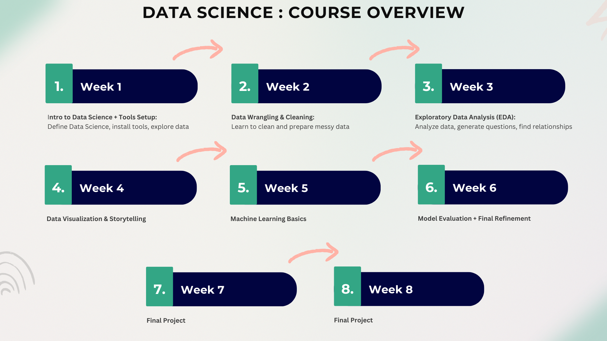

<h1 align="center">
    <strong>Introduction to Data Science: An Intensive 8-Week Course on Data Science Fundamentals</strong>
</h1>

  

Master the fundamentals of data science by building an end-to-end data science project from scratch. Gain hands-on experience with real-world data..

## 🗓️ Course Structure

- **Duration:** 7 Modules (1 module per week) + Final Project
- **Class Time:** 300 minutes per module (5 hours)
- **Format:** Combination of lectures, live coding, hands-on labs, and final group project
- **Final Output:** Team-based data science project and presentation

---

## 📚 Modules

### 🔹 Module 1: Introduction to Data Science & Tools
- Overview of the data science workflow
- Workflow overview and real-world examples
- Tool setup: Python, Jupyter, Pandas
- Intro to datasets and course expectations

### 🔹 Module 2: Data Wrangling & Cleaning
- Importing and inspecting data
- Handling missing values, duplicates, and data types
- Clean and structure your dataset

### 🔹 Module 3: Exploratory Data Analysis (EDA)
- Descriptive statistics and correlation
- Detecting patterns and outliers
- Visual EDA using Seaborn and Pandas
- Mini-case study analysis

### 🔹 Module 4: Data Visualization & Storytelling
- Visualization types and design principles
- Dashboards, plot styling, and color theory
- Recreate a news-style data graphic

### 🔹 Module 5: Introduction to Machine Learning
- ML concepts: features, labels, model types
- Train/test split, model evaluation
- Linear regression and logistic regression
- Build and evaluate your first model

### 🔹 Module 6: Model Evaluation & Refinement
- Model metrics: accuracy, precision, recall, F1
- Cross-validation, feature importance
- Improving performance and avoiding overfitting
- Finalize and document ML models

## 🚀 Group Project (Weeks 7 & 8)

The final 1.5 weeks are dedicated to applying everything you've learned in a team-based data science project. You'll work in small groups to choose a dataset, analyze it, model it, and present your findings.

### 🔹 Module 7: Final Project Development
- Team formation and dataset selection
- Perform EDA and visual analysis
- Build and evaluate a machine learning model
- Craft data-driven narratives and visualizations
- Begin drafting slides and documentation
- Peer/instructor feedback on progress

### 🔹 Module 8: Final Project Showcase
- Final team presentations (10 min each)
- Live Q&A and instructor feedback
- Reflect on course journey and next steps
- Tips for portfolios and real-world DS work
